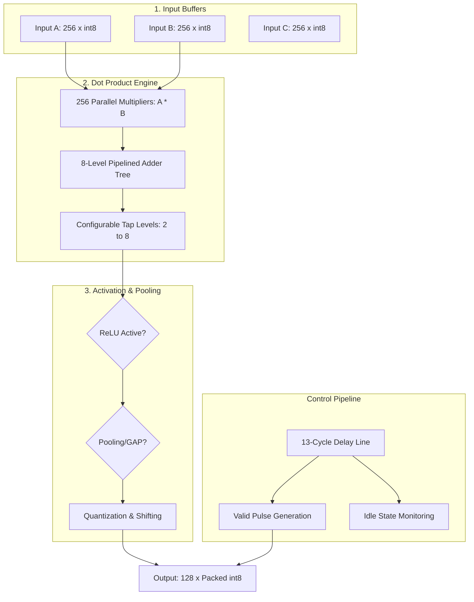

```mermaid
graph TD
    subgraph Input_Stage [1. Input Buffers]
        A[Input A: 256 x int8]
        B[Input B: 256 x int8]
        C[Input C: 256 x int8]
    end

    subgraph Compute_Core [2. Dot Product Engine]
        MULT[256 Parallel Multipliers: A * B]
        ADDER_TREE[8-Level Pipelined Adder Tree]
        TAP[Configurable Tap Levels: 2 to 8]
        
        A --> MULT
        B --> MULT
        MULT --> ADDER_TREE
        ADDER_TREE --> TAP
    end

    subgraph Post_Processing [3. Activation & Pooling]
        RELU{ReLU Active?}
        POOL{Pooling/GAP?}
        QUANT[Quantization & Shifting]
        
        TAP --> RELU
        RELU --> POOL
        POOL --> QUANT
    end

    subgraph Control_Logic [Control Pipeline]
        DELAY[13-Cycle Delay Line]
        VALID[Valid Pulse Generation]
        IDLE[Idle State Monitoring]
        
        DELAY --> VALID
        DELAY --> IDLE
    end

    QUANT --> OUT[Output: 128 x Packed int8]
    VALID --> OUT
```
